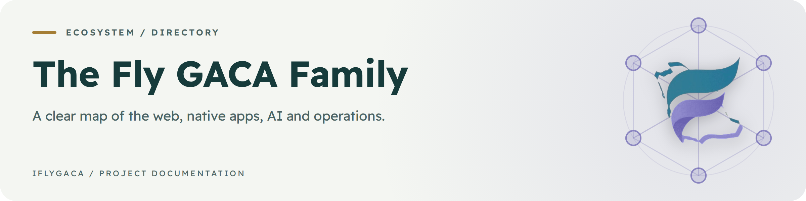
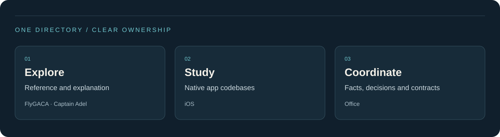
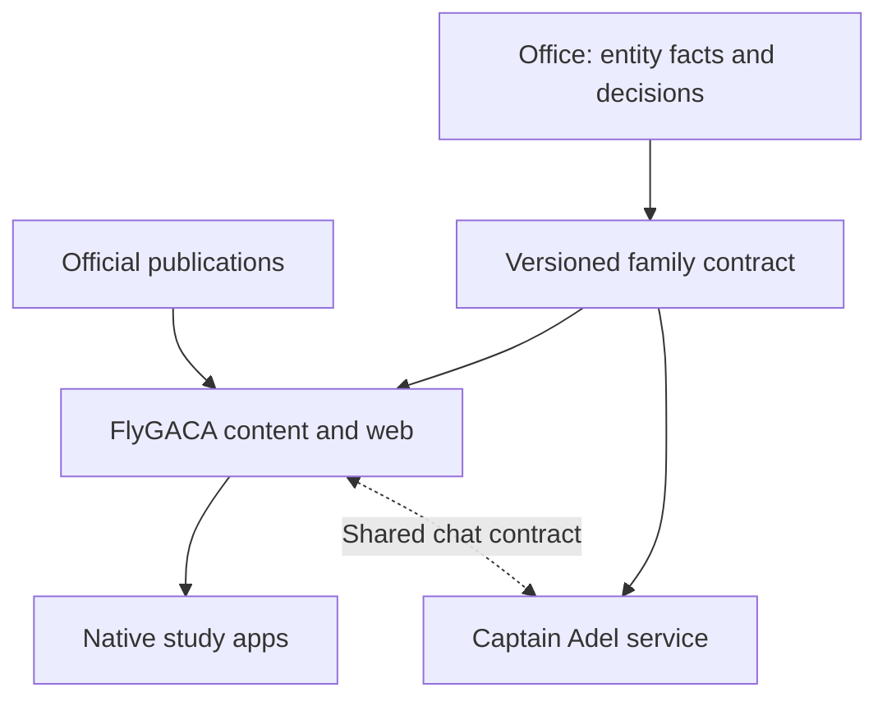

<a id="the-fly-gaca-family"></a>

# The Fly GACA Family

**Find the right product, codebase and source of truth.**

[FlyGACA](https://flygaca.com) · [Captain Adel](https://captadel.com) · [GitHub](https://github.com/iflygaca)

The public directory for Fly GACA's aviation learning ecosystem. Start with the product you need, then use its own repository guide for setup, architecture and release status.

> [!IMPORTANT]
> Fly GACA is an independent educational platform, not affiliated with, endorsed by, or operated
> by GACA or the Government of Saudi Arabia. GACA (gaca.gov.sa) is always the authoritative
> source; both apps cite it and defer to it.
> Educational use only. Verify current official publications before relying on any aviation information.


<a id="choose-your-destination"></a>

<details>
<summary>On this page</summary>

- [Choose your destination](#choose-your-destination)
- [How the pieces connect](#how-the-pieces-connect)
- [Source-of-truth rules](#source-of-truth-rules)
- [Brand marks](#brand-marks)
- [Hugging Face](#hugging-face)
- [Direction for 2027](#direction-for-2027)
- [Processing and rights](#processing-and-rights)
- [بالعربية](#بالعربية)
- [Keep this guide healthy](#keep-this-guide-healthy)

</details>

## Choose your destination

| Audience | Destination | Purpose |
| --- | --- | --- |
| Student pilots and instructors | [FlyGACA](https://flygaca.com) | Regulatory reference, study and flight tools |
| Learners with a question | [Captain Adel](https://captadel.com) | Bilingual explanations with source evidence |
| Native-app developers | [iOS](https://github.com/iflygaca/iOS) | SwiftUI study apps and the separate Captain Adel app |
| Product developers | [FlyGACA repository](https://github.com/iflygaca/FlyGACA) | Web app, API and content exports |
| AI-service developers | [Captain-Adel repository](https://github.com/iflygaca/Captain-Adel) | Retrieval, grounding, tools and evaluations |
| Authorized operators | [Office](https://github.com/iflygaca/Office) | Internal strategy, governance and operating documents |

Some repositories are private. A link in this directory does not grant access.

<a id="how-the-pieces-connect"></a>

## How the pieces connect



<a id="source-of-truth-rules"></a>

## Source-of-truth rules

| Item | Owner | Consumer responsibility |
| --- | --- | --- |
| Web corpus and study exports | FlyGACA | Native apps validate content and update behaviour |
| Chat contract | FlyGACA | Both services keep required fields compatible |
| Entity facts and repository roster | Office | Consumers preserve the stamped contract |
| App project and release state | iOS | Verify schemes, signing, device QA and store status |

The family contract is mirrored in Office, FlyGACA and Captain-Adel. Change it at the owning source, re-stamp it and coordinate the consumer updates. This directory carries no fourth contract copy.

<a id="brand-marks"></a>

## Brand marks

Every app shares one falcon mark. The upper wing stays blue and only the lower wing's gradient changes per app. The source, the full-size variants and the generator live in [`iflygaca/Office`](https://github.com/iflygaca/Office) (`11-brand/logos/` and `tools/brand/`); the copies here are for reference.

| Mark | App | Lower wing |
| --- | --- | --- |
|  | FlyGACA | Original green |
|  | ELPT | Desert gold |
|  | AIP | Terracotta |
|  | PPL | Soft indigo |
|  | CPL | Dusty rose |
|  | IR | Aqua teal |
|  | ATPL | Platinum |
|  | Captain Adel | Fresh lime |
<a id="hugging-face"></a>

## Hugging Face

[The flygaca namespace](https://huggingface.co/flygaca) hosts related retrieval and evaluation assets. Their source and publishing instructions live in [Captain-Adel/huggingface](https://github.com/iflygaca/Captain-Adel/tree/main/huggingface). Check the Hub card and latest workflow before describing an asset as live or a model as trained.

<a id="direction-for-2027"></a>

## Direction for 2027

Make the journey between reference, practice and explanation easier while keeping ownership explicit. App convergence and unified purchases are delivery milestones, not guarantees made by this directory. Read the current roadmaps and Office decision log.

<a id="processing-and-rights"></a>

## Processing and rights

Deployments, databases and inference providers can use different regions. Consult each product's configuration and hosting notes; this ecosystem should not be described as Saudi-only. Each repository has its own license. GACAR text retains GACA's rights.

<a id="بالعربية"></a>

## بالعربية

فلاي قاكا منظومة تعليمية مستقلة لطلاب الطيران والمدربين. يقدم الموقع المراجع والدراسة والأدوات، ويقدم الكابتن عادل الشرح المستند إلى المصادر، ويحتوي مستودع iOS على التطبيقات الأصلية. وثائق التشغيل في Office مخصصة للمصرح لهم. تحقق من حالة الإصدار في مستودع المنتج، ومن النص التنظيمي في المصدر الرسمي.

## Keep this guide healthy

Run the dependency-free documentation check from the repository root:

```bash
node .github/scripts/check-readmes.mjs
```

It checks tracked README links to repository paths and sections on the same page. Review external URLs, screenshots and Mermaid diagrams separately. Update feature claims only when the source and release evidence support them.


---

<div align="center">

<sub dir="rtl">🇸🇦 صنع في المملكة العربية السعودية</sub><br />
<sub>Crafted with excellence in Saudi Arabia</sub>

</div>
