

# The Fly GACA Family

A clear map of the web, native apps, AI and operations.

[FlyGACA](https://flygaca.com) · [Captain Adel](https://captadel.com) · [Family directory](https://github.com/iflygaca/FlyGACA-Family)

**Explore:** [At a glance](#at-a-glance) · [The family map](#the-family-map) · [Repository roster](#repository-roster) · [How a learner moves through the family](#how-a-learner-moves-through-the-family) · [The family contract](#the-family-contract) · [Working across repositories](#working-across-repositories) · [Hugging Face](#hugging-face) · [Data residency and PDPL](#data-residency-and-pdpl) · [Licensing](#licensing) · [عن المنظومة (بالعربية)](#عن-المنظومة-بالعربية)

> [!IMPORTANT]
> **An independent educational ecosystem.** Fly GACA is not affiliated with, endorsed by, or
> operated by the General Authority of Civil Aviation (GACA) or the Government of Saudi Arabia.
> Nothing here is for operational use in flight. For any regulation, the current official text
> at [gaca.gov.sa](https://gaca.gov.sa) is what counts.
>
> 
<strong>منظومة تعليمية مستقلة.</strong> فلاي جاكا غير تابعة للهيئة العامة للطيران المدني (GACA) ولا معتمدة منها ولا تديرها، ولا علاقة لها بالحكومة السعودية. لا شيء هنا مخصص للاستخدام التشغيلي أثناء الطيران. المرجع الرسمي لأي لائحة هو نصها الحالي على <a href="https://gaca.gov.sa">gaca.gov.sa</a>.

---

---

## At a glance

| | |
| :--- | :--- |
| **Organisation** | [`github.com/iflygaca`](https://github.com/iflygaca) |
| **Operating company** | BDA Company International · شركة بدع الدولية (Riyadh) |
| **Regulatory scope** | All **74** numbered GACAR Parts, plus topical handbooks, aerodromes and VFR charts |
| **Doctrine** | Cite the exact section or refuse. Never invent a regulation. |
| **Hosting** | Google Cloud `me-central2` (Dammam) only. Captain Adel's `deploy.sh` refuses any other region. |
| **Languages** | English and Arabic, with right-to-left layout throughout |
| **Open item** | Chat inference through Gemini runs outside the Kingdom ([details](#-data-residency-and-pdpl)) |

---

## The family map

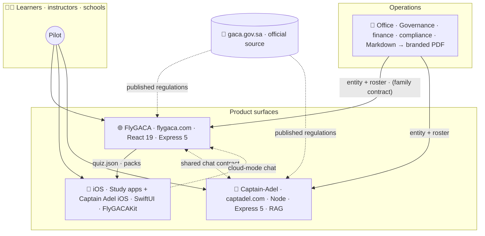

---

## Brand marks

Every app shares one falcon mark. The upper wing stays blue and only the lower wing's gradient changes per app. The source, the full-size variants and the generator live in [`iflygaca/Office`](https://github.com/iflygaca/Office) (`11-brand/logos/` and `tools/brand/`); the copies here are for reference.

| Mark | App | Lower wing |
| --- | --- | --- |
| 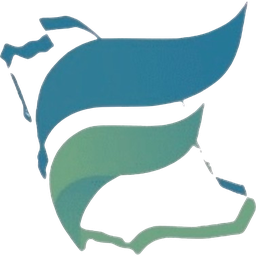 | FlyGACA | Original green |
| 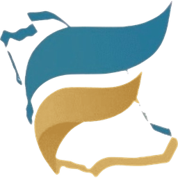 | ELPT | Desert gold |
| 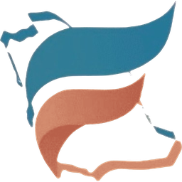 | AIP | Terracotta |
| 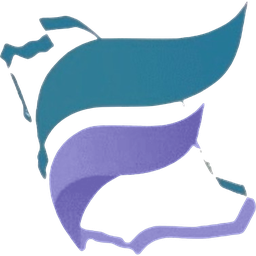 | PPL | Soft indigo |
| 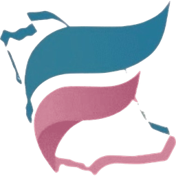 | CPL | Dusty rose |
| 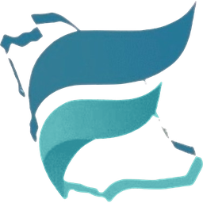 | IR | Aqua teal |
| 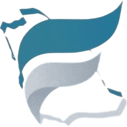 | ATPL | Platinum |
| 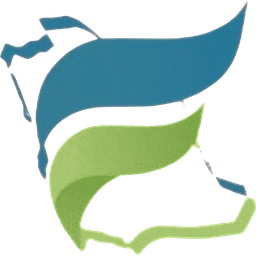 | Captain Adel | Fresh lime |

## Repository roster

| | Repository | What it is | Stack | Licence |
| :---: | :--- | :--- | :--- | :--- |
| 🌐 | **[FlyGACA](https://github.com/iflygaca/FlyGACA)** | The product: the bilingual web app, its API, the GACAR library, 55+ flight tools and ground school | React 19 · Vite · TypeScript · CSS Modules · Express 5 · PostgreSQL · Cloud Run | MIT |
| 📱 | **[iOS](https://github.com/iflygaca/iOS)** | Native apps. `apps/flygaca-ios` is the `FlyGACAKit` study family; `apps/captain-adel-ios` is the offline GACAR co-pilot | Swift 5.9+ · SwiftUI · SPM · iOS 17+ | MIT (`flygaca-ios`) |
| 🤖 | **[Captain-Adel](https://github.com/iflygaca/Captain-Adel)** | The standalone AI flight instructor service behind captadel.com. FlyGACA's chat runs its own brain on the same `chat` contract. | Node 20+ · Express 5 · BM25 (+ optional dense/rerank) · Gemini / ALLaM | Proprietary |
| 🏢 | **[Office](https://github.com/iflygaca/Office)** | Internal operating documents: strategy, governance, legal, finance, KSA compliance, people, brand | Markdown + HTML → A4 PDF (headless Chromium) | Apache 2.0 (own material) |

<b>Archived and related repositories</b>

| Repository | Status |
| :--- | :--- |
| [`iflygaca/FlyGACA-ios`](https://github.com/iflygaca/FlyGACA-ios) | Merged into `iflygaca/ios` under `apps/flygaca-ios/`, with full history |
| [`iflygaca/Captain-Adel-iOS`](https://github.com/iflygaca/Captain-Adel-iOS) | Merged into `iflygaca/ios` under `apps/captain-adel-ios/`, with full history |
| [`iflygaca/FlyGACA-app`](https://github.com/iflygaca/FlyGACA-app) | Archived predecessor of `iflygaca/FlyGACA`. Read-only. |
| [`iflygaca/awesome-saudi-open-source`](https://github.com/iflygaca/awesome-saudi-open-source) | A community list of Saudi open-source projects. It is not a Fly GACA product and does not take part in the contract below. |

---

## How a learner moves through the family

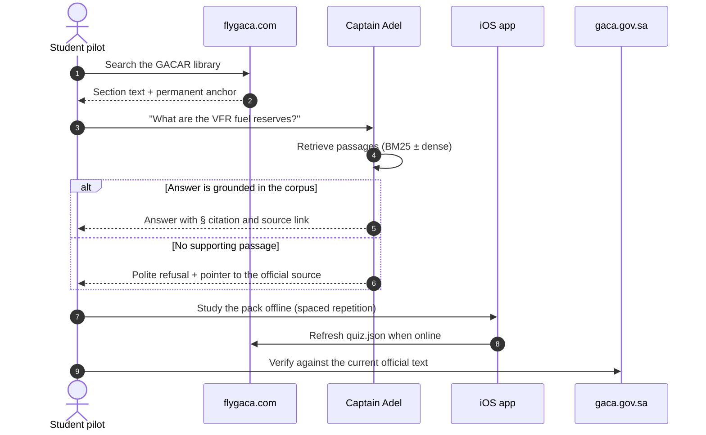

---

## The family contract

`contracts/flygaca-family.json` is committed **byte-identically** to three repositories: Office,
FlyGACA and Captain-Adel. Each block has exactly one owner, and only that owner edits it:

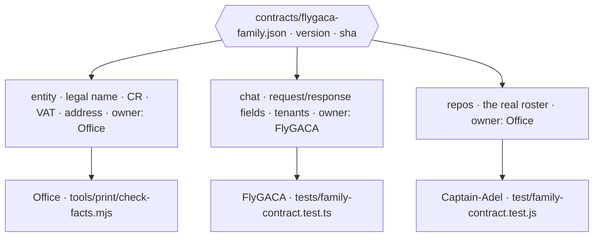

| Block | Owner | Source of truth | Checked by |
| :--- | :--- | :--- | :--- |
| `entity` | Office | `01-governance/company-facts.md` | `check-facts.mjs` (also asserts that **no banking data** is in the file) |
| `chat` | FlyGACA | `server/src/contract.ts` | Both product repos' contract tests. Captain Adel's `/v1/chat` returns a **superset** of these fields. |
| `repos` | Office | Office's repository table | Each repo's parity test |

**To change it:** edit the owner's copy, bump `version`, re-stamp with
`node tools/contracts/stamp-manifest.mjs contracts/flygaca-family.json` (in Office), copy the file
verbatim into the other two repos, and open all three PRs together.

> [!NOTE]
> `iflygaca/ios` does **not** carry a copy of the contract. The three-repo set is deliberate, so
> don't add a fourth copy without updating the stamping tool and every repo's `CLAUDE.md`.

---

## Working across repositories

<table>
<tr>
<td width="50%" valign="top">

### Independence first

Each repository has its own CI, its own release cadence and its own domain.

- **Captain-Adel** retrieval or prompt work stays in `src/brain/` and `evals/`
- **FlyGACA** UI work stays in `src/`; the API keeps its shape in `server/`
- **iOS** apps build and ship separately from each other
- **Office** policy lives in the numbered sections

</td>
<td width="50%" valign="top">

### When a change spans repos

1. **Find the owner.** Which repo defines the thing?
2. **Ship the owner first**, to its `main`.
3. **Update the consumers** once the published artifact exists.
4. For contract changes, open **all three PRs together**.

</td>
</tr>
</table>

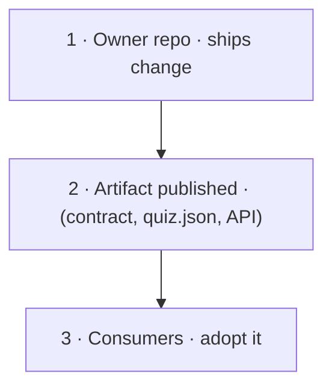

---

## Hugging Face

The [`@flygaca`](https://huggingface.co/flygaca) organisation mirrors parts of the Captain-Adel repository:

| Hub asset | Type | Source in Captain-Adel | Status |
| :--- | :--- | :--- | :--- |
| [`flygaca/captain-adel`](https://huggingface.co/spaces/flygaca/captain-adel) | Space (Gradio) | `app.py`, synced by `.github/workflows/huggingface-sync.yml` | Live |
| [`flygaca/gacar-assistant-evals`](https://huggingface.co/datasets/flygaca/gacar-assistant-evals) | Dataset | `evals/gacar-assistant-evals.jsonl` | **150** bilingual regression cases |
| [`flygaca/CaptAdel`](https://huggingface.co/flygaca/CaptAdel) | Model repo | `hf-phase-0/CaptAdel-model-README.md` | **In development.** No weights are published yet. |

---

## Data residency and PDPL

| Layer | Where it runs | Status |
| :--- | :--- | :---: |
| Web API, database, static assets, corpus buckets | Google Cloud `me-central2` (Dammam) | ✅ |
| Captain Adel service | Cloud Run `me-central2`. `deploy/deploy.sh` hard-fails on any other region. | ✅ |
| iOS study and search logic | On device | ✅ |
| **Chat inference (English, default)** | Google Gemini API: a global endpoint with no Kingdom pinning | ⚠️ open |
| **Chat inference (Arabic)** | ALLaM, in-Kingdom, **only when `ALLAM_BASE_URL` is configured** (off by default) | ⚠️ conditional |

> [!WARNING]
> **Open item, disclosed rather than hidden.** Storage and compute are in the Kingdom.
> **Inference is not, yet.** Don't describe the family as "100% in-Kingdom" until the Gemini path
> is closed. `me-central1` is Doha, Qatar. It has never been a compliant fallback.

Learner data is limited to name, email and progress. The family collects no passport, address,
biometric or voice data.

---

## Licensing

| Repository | Licence |
| :--- | :--- |
| FlyGACA, iOS (`apps/flygaca-ios`), this repository | MIT |
| Captain-Adel | Proprietary, all rights reserved |
| Office | Apache 2.0 for Fly GACA's own material |

GACAR text belongs to GACA wherever it is quoted. None of the licences above cover it.

---

## عن المنظومة (بالعربية)

**فلاي جاكا** منظومة تعليمية مستقلة للطيران المدني في المملكة العربية السعودية، تتكون من أربعة مستودعات:

| المستودع | الدور |
| :--- | :--- |
| 🌐 **FlyGACA** | المنصة الرئيسية: مكتبة لوائح GACAR بأجزائها الـ 74، وأكثر من 55 أداة طيران، والمدرسة الأرضية |
| 📱 **iOS** | تطبيقات آيفون أصلية: عائلة تطبيقات الدراسة، وتطبيق كابتن عادل الذي يعمل دون اتصال |
| 🤖 **Captain-Adel** | مدرّب الطيران الذكي الذي يستشهد بنص المادة أو يمتنع عن الإجابة |
| 🏢 **Office** | وثائق التشغيل: الحوكمة والمالية والامتثال والهوية البصرية |

**موقع البيانات:** التخزين والحوسبة في منطقة `me-central2` (الدمام). أما استدلال المحادثة عبر Gemini فيتم خارج المملكة حاليًا. هذا بند مفتوح نعلنه ولا نخفيه.

---

**Built for pilots · Grounded in the regulations · Verified against GACA**

[flygaca.com](https://flygaca.com) · [captadel.com](https://captadel.com) · [Hugging Face](https://huggingface.co/flygaca) · Feedback: [i@flygaca.com](mailto:i@flygaca.com)

---

🇸🇦 صنع في المملكة العربية السعودية 
Crafted with excellence in Saudi Arabia

